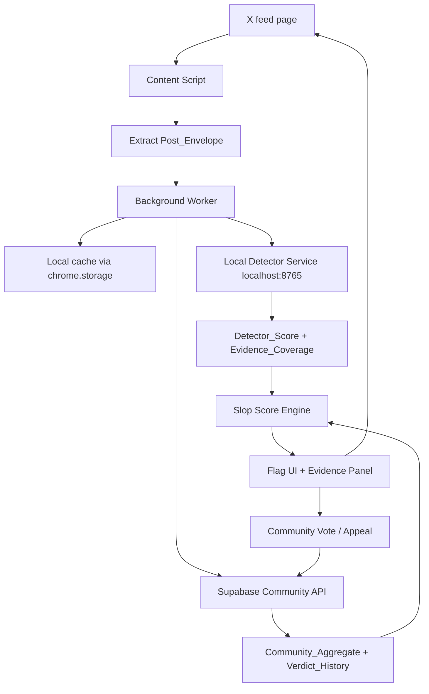
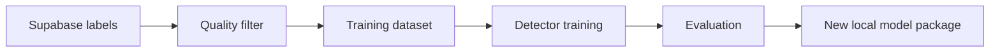

# Design Document

## Overview

Slop Frog is a local-first Chrome extension for X. The extension observes visible posts while the user scrolls, extracts a normalized `Post_Envelope`, sends it to a detector running on the user's laptop, fetches community label aggregates from Supabase, computes a Slop Score result, and inserts a simple flag into the X feed.

The design is optimized for a three-hour hackathon build by two people. The first phase creates shared contracts that both people must honor. After those contracts are verified, Person A owns the Chrome extension and in-feed UX while Person B owns the local detector service and Supabase community layer. The final integration phase joins both tracks and verifies the demo.

### Design Principles

1. **Shared contracts first.** The extension, detector, and Supabase layer must agree on data shapes before parallel work begins.
2. **Local inference only for MVP.** The local detector service runs on `localhost`; no Modal, hosted inference, or cloud model serving is implemented.
3. **X first.** The MVP targets X/Twitter only. Platform adapters should be structured so LinkedIn can be added later, but not built now.
4. **Simple visible labels.** Users see red, yellow, green, or gray while scrolling. Details live in the evidence panel.
5. **Gray is not green.** Gray means there is not enough signal or the system failed to score. Green means enough signal and low AI evidence.
6. **Supabase is the community memory.** Supabase stores votes, reviewer weights, appeals, aggregate labels, hashes, and verdict history. Raw media is not stored.
7. **No hidden training pipeline.** Future training architecture is documented, but disabled in the MVP.
8. **Verified tasks only.** A task is complete only after its verification step has passed.

## Technology Stack

| Concern | MVP Choice |
| --- | --- |
| Browser integration | Chrome Extension Manifest V3 |
| Target platform | X and Twitter domains |
| Extension language | TypeScript preferred; plain JavaScript acceptable if time is tight |
| Extension UI | Content script overlays, popup/options page |
| Local detector | Python FastAPI service on `http://localhost:8765` |
| Detector implementation | Bouncer-inspired local text scoring; deterministic heuristic fallback allowed for demo |
| Community data | Supabase Postgres |
| Auth | Anonymous/demo reviewer ID stored locally for MVP |
| Charts | Lightweight SVG or DOM charts in evidence panel |
| Packaging | Developer-mode extension plus local detector command |

## High-Level Architecture



## Shared Contracts

The shared contracts are the hard boundary between Person A and Person B. They must be finished and verified before the team splits.

### `Post_Envelope`

```ts
type Platform = "x";

interface PostEnvelope {
  platform: Platform;
  contentKey: string;
  tweetId?: string;
  url?: string;
  authorHandle?: string;
  visibleText: string;
  normalizedText: string;
  textHash?: string;
  imageUrls?: string[];
  extractedAt: string;
}
```

### `Score_Request`

```ts
interface ScoreRequest {
  post: PostEnvelope;
  settings: {
    evidenceCoverageMinimum: number;
    redThreshold: number;
    yellowThreshold: number;
  };
}
```

### `Score_Response`

```ts
type FlagLabel = "red" | "yellow" | "green" | "gray";

interface ScoreResponse {
  ok: boolean;
  detectorScore?: number;
  evidenceCoverage: number;
  labelRecommendation: FlagLabel;
  reasons: string[];
  modalityScores: {
    text?: ModalityScore;
    image?: ModalityScore;
    audio?: ModalityScore;
    video?: ModalityScore;
  };
  modelName: string;
  modelVersion: string;
  errorCode?: string;
}

interface ModalityScore {
  status: "available" | "unsupported" | "not_enough_signal" | "error";
  score?: number;
  reason?: string;
}
```

### `Community_Aggregate`

```ts
interface CommunityAggregate {
  contentKey: string;
  voteCount: number;
  weightedAiScore: number | null;
  looksAiWeight: number;
  looksHumanWeight: number;
  unsureWeight: number;
  appealStatus?: "none" | "submitted" | "under_review" | "accepted" | "rejected";
  latestVerdictLabel?: FlagLabel;
  updatedAt?: string;
}
```

### `Slop_Score_Result`

```ts
interface SlopScoreResult {
  contentKey: string;
  label: FlagLabel;
  slopScore: number | null;
  detectorScore: number | null;
  communityScore: number | null;
  evidenceCoverage: number;
  reasons: string[];
  autoFiltered: boolean;
}
```

## Runtime Flow

### 1. Feed extraction

The Content_Script uses a `MutationObserver` and viewport scanning to find X post containers. For each candidate, it extracts visible text, author handle, URL/permalink, tweet ID when possible, and image URLs. It normalizes text by trimming whitespace, lowering casing for hash input, and removing volatile UI text when possible.

Extraction failures return a gray result rather than throwing into the page.

### 2. Local scoring

The Background_Worker sends a `Score_Request` to `http://localhost:8765/score`. The Local_Detector_Service returns a `Score_Response`.

For the hackathon, the detector can be implemented in layers:

1. Try the Bouncer-inspired detector path if available.
2. If unavailable, use a deterministic heuristic scoring function.
3. Always return a typed response, even on error.

The heuristic fallback exists only so integration and UI can be verified before model integration is perfect.

### 3. Community lookup

The Background_Worker requests the community aggregate for `contentKey` from Supabase. If Supabase is unavailable, the extension still displays the local detector result and marks community data unavailable in the Evidence_Panel.

### 4. Slop Score calculation

The Slop Score engine runs locally in the extension:

```text
if score_response.labelRecommendation == "gray":
  label = "gray"
else:
  communityScore = aggregate.weightedAiScore if available
  slopScore = 0.75 * detectorScore + 0.25 * communityScore
  if communityScore is missing: slopScore = detectorScore
  label = threshold(slopScore)
```

Default thresholds:

- red: score above 75;
- yellow: score from 40 to 75 inclusive;
- green: score below 40;
- gray: evidence unavailable or insufficient, not score-based.

### 5. Flag insertion and auto-filtering

The Content_Script inserts a compact flag control into the post container. If auto-filter is enabled and the final label is red, the post is collapsed with a reveal control.

### 6. Community vote and appeal

When the user votes or appeals, the extension sends the explicit action to Supabase. Normal feed browsing does not upload every post as a vote. For the MVP, text may be stored only for explicitly labeled posts. Raw media is not stored.

## Module Layout

```text
extension/
  manifest.json
  src/
    content/
      xAdapter.ts
      flagUi.ts
      evidencePanel.ts
    background/
      index.ts
      localDetectorClient.ts
      supabaseClient.ts
      slopScore.ts
      cache.ts
    popup/
      popup.html
      popup.ts
      popup.css
    shared/
      contracts.ts
      thresholds.ts

local-detector/
  app.py
  scorer.py
  schemas.py
  requirements.txt
  README.md

supabase/
  schema.sql
  seed.sql

specs/slop-frog/
  requirements.md
  design.md
  tasks.md
```

## Chrome Extension Design

### Manifest permissions

The MVP should request only:

```json
{
  "permissions": ["storage"],
  "host_permissions": [
    "https://x.com/*",
    "https://twitter.com/*",
    "http://localhost:8765/*",
    "https://YOUR_SUPABASE_PROJECT.supabase.co/*"
  ]
}
```

No `all_urls` permission. No blanket access to every website.

### Content script

Responsibilities:

- detect X posts;
- extract `Post_Envelope`;
- render flags;
- render evidence panel;
- collapse red posts when auto-filter is enabled;
- observe new posts while scrolling.

### Background worker

Responsibilities:

- receive extracted posts from content script;
- deduplicate by `contentKey`;
- call local detector;
- call Supabase;
- compute Slop Score result;
- cache results;
- send final result back to content script.

### Popup/options UI

Minimum controls:

- detector health status;
- Supabase connection status;
- show numeric score toggle;
- auto-filter red posts toggle;
- local detector URL display.

## Local Detector Design

The local detector is a FastAPI service.

Endpoints:

```text
GET /health
POST /score
```

`GET /health` returns:

```json
{
  "ok": true,
  "modelName": "slop-frog-local-demo",
  "modelVersion": "0.1.0"
}
```

`POST /score` returns the shared `Score_Response`.

Evidence coverage starts with text length:

```text
40 points: at least 20 analyzable words
20 points: 8 to 19 analyzable words
30 points: analyzable image present
30 points: known fingerprint match
20 points: community aggregate exists
10 points: provenance metadata exists
```

For the MVP, text alone can be enough if it has at least 30 analyzable words. Short posts should become gray unless a known fingerprint or community signal exists.

## Supabase Design

Tables:

### `content_items`

Stores identity and optional explicitly labeled text.

```sql
content_key text primary key,
platform text not null,
tweet_id text,
url text,
text_hash text,
text_snapshot text,
author_handle text,
created_at timestamptz default now(),
updated_at timestamptz default now()
```

### `reviewers`

```sql
reviewer_id text primary key,
display_name text,
reputation_weight numeric not null default 0.25,
review_count integer not null default 0,
created_at timestamptz default now()
```

### `community_votes`

```sql
id uuid primary key default gen_random_uuid(),
content_key text references content_items(content_key),
reviewer_id text references reviewers(reviewer_id),
vote text not null check (vote in ('looks_ai', 'looks_human', 'unsure')),
reviewer_weight numeric not null,
created_at timestamptz default now()
```

### `appeals`

```sql
id uuid primary key default gen_random_uuid(),
content_key text references content_items(content_key),
reviewer_id text references reviewers(reviewer_id),
reason text not null,
status text not null check (status in ('submitted', 'under_review', 'accepted', 'rejected')),
created_at timestamptz default now(),
resolved_at timestamptz
```

### `verdict_history`

```sql
id uuid primary key default gen_random_uuid(),
content_key text references content_items(content_key),
event_type text not null,
label text check (label in ('red', 'yellow', 'green', 'gray')),
slop_score numeric,
detector_score numeric,
community_score numeric,
metadata jsonb,
created_at timestamptz default now()
```

### `community_aggregates` view

This view computes weighted community score:

```text
looks_ai = 100
unsure = 50
looks_human = 0
weightedAiScore = sum(vote_score * reviewer_weight) / sum(reviewer_weight)
```

## Training Pipeline Placeholder

The architecture reserves a future backend job:



For the MVP, this entire lane is inactive. No backend job fetches X posts. No scheduled training runs. No automatic media collection. The only data written is data created by explicit user labeling or appeal actions.

## Testing Strategy

### Shared contract tests

- Validate fixture `Post_Envelope` objects.
- Validate `Score_Request` and `Score_Response`.
- Validate Slop Score thresholds.
- Validate gray vs green distinction.

### Extension verification

- Load unpacked extension in Chrome.
- Confirm content script runs only on X/Twitter.
- Confirm at least three visible posts receive a flag.
- Confirm newly loaded posts are detected while scrolling.
- Confirm popup shows detector health status.
- Confirm red auto-filter can collapse and reveal a post.

### Local detector verification

- Run `GET /health`.
- Run `POST /score` on three fixtures.
- Confirm short text returns gray.
- Confirm long/high-risk demo fixture returns red or yellow.
- Confirm service returns typed error if model path is unavailable.

### Supabase verification

- Apply schema.
- Insert or upsert a demo reviewer.
- Submit one vote.
- Fetch aggregate for that content key.
- Submit one appeal.
- Confirm verdict history stores an event.

### Integration verification

- Start local detector.
- Load extension.
- Open X.
- Confirm extension extracts posts.
- Confirm detector returns scores.
- Confirm community aggregate is fetched.
- Confirm Slop Score labels render.
- Confirm one vote reaches Supabase.
- Confirm one red post can be auto-filtered.

No implementation task is considered complete until its verification step passes.
