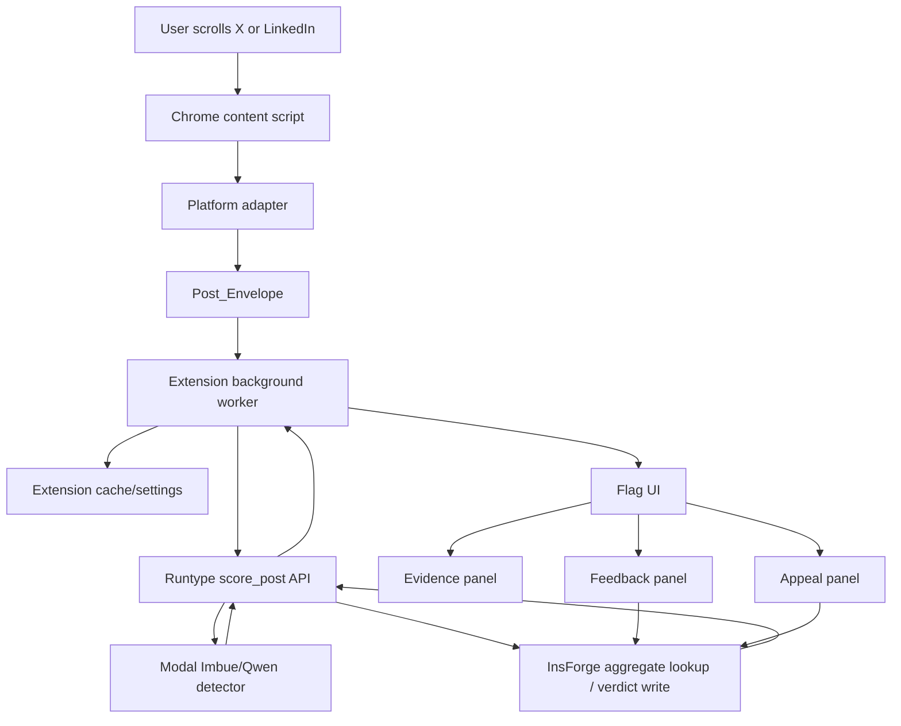
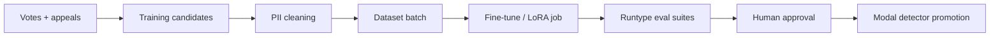

# Design Document

## Overview

Slop Frog is a Chrome extension that adds a lightweight AI-content safety layer to X and LinkedIn. While the user scrolls, the extension extracts visible post text and limited metadata, sends a scoring request through the product workflow, and renders a compact flag directly on the post.

The new hackathon version is no longer a purely local-laptop detector plus Supabase project. That approach was useful for the first build, but the Imbue/Qwen detector is too heavy for reliable MacBook Air inference. The current product direction is:

- **Chrome extension:** user-facing feed layer for X and LinkedIn.
- **Runtype:** product API, workflow orchestration, learning-loop coordination, and eval gates.
- **Modal:** hosted GPU inference for the Imbue/Qwen text detector.
- **InsForge:** backend database, secrets, functions, app data, reviewer reputation, votes, appeals, verdict history, and cleaned training-data metadata.
- **No Cotal:** intentionally omitted because it does not clearly serve the product right now.

The branch that currently makes the most sense for this direction is `modal-imbue-inference`. It already contains the Modal inference work, InsForge project link, Runtype setup notes, and recent extension fixes. The main branch can be updated later after this branch is demo-stable.

## Product shape from the user perspective

The user installs Slop Frog, opens X or LinkedIn, and scrolls normally. Each supported post gets a small control group:

- a colored flag for the Slop Score evidence;
- a feedback icon for community judgment;
- an appeal icon for challenging a label.

The user does not paste posts into a separate app. The user does not read a big explanation beside every post. Slop Frog behaves like a small trust annotation layer inside the feed.

Flag meaning:

- **Red:** high Slop Score.
- **Yellow:** medium or mixed Slop Score.
- **Green:** low Slop Score.
- **Gray:** not enough signal or the detector/workflow was unavailable.

Gray is a system honesty state, not a human-content label.

## Design principles

1. **Scroll-first, not paste-first.** The extension must work in the feed.
2. **Simple labels, inspectable evidence.** The feed shows a flag; details stay one click away.
3. **Contestable by design.** Users can vote and appeal.
4. **Autonomous workflow, human-gated learning.** Runtype can coordinate data cleaning and evals, but model promotion requires gates.
5. **Modal for heavy inference.** Do not force hackathon judges or users to run a huge model locally.
6. **InsForge for backend memory.** Supabase is no longer the target backend.
7. **Privacy-minimized by default.** Store explicit labels and limited metadata, not everyone's entire feed.
8. **No fake confidence.** Unsupported media and insufficient evidence must be visible as gray/unsupported.
9. **UI should feel native.** Compact icons, clean spacing, strong contrast, minimal text.

## Technology stack

| Concern | Current direction |
| --- | --- |
| Browser integration | Chrome Extension Manifest V3 |
| Platforms | X/Twitter and LinkedIn |
| In-feed UI | Content-script DOM UI |
| Product workflow layer | Runtype product APIs, flows, agents, evals |
| Detector serving | Modal hosted endpoint |
| Detector model | Imbue-released Qwen-based text detector path / compatible artifact |
| Backend | InsForge Postgres, functions, secrets |
| Community data | InsForge tables and aggregate queries |
| Learning loop | Runtype-managed, InsForge-backed, Modal-executed training/eval jobs |
| Cotal | Out of scope |

## High-level architecture



During debugging, the extension may call Modal directly to isolate failures. For product architecture and sponsor alignment, the stable path should be extension -> Runtype -> Modal/InsForge.

## Runtime flow

### 1. Platform detection

The content script chooses a platform adapter based on the current URL.

Supported adapters:

- `x`
- `linkedin`

Unsupported sites do nothing.

### 2. Post extraction

The adapter finds visible post containers and extracts:

- platform;
- post URL when available;
- platform post ID when available;
- author handle/name when available;
- visible text;
- normalized text;
- text hash;
- visible image URLs when available;
- timestamp when available;
- extraction timestamp.

The extension does not upload raw media. For LinkedIn, the extension may use text visible in the browser session, but the backend must not scrape LinkedIn later.

### 3. Scoring request

The background worker creates a `Score_Request` and sends it to the Runtype `score_post` endpoint.

If Runtype is unavailable during a local debug run, the extension may use a configured Modal detector URL directly.

### 4. Runtype scoring workflow

Runtype should own the product-level scoring workflow:

1. validate the request shape;
2. call the Modal detector;
3. fetch any available InsForge community aggregate;
4. compute or normalize the Slop Score result;
5. write a verdict-history event when appropriate;
6. return a stable response to the extension.

This makes Runtype useful in a non-stupid way: it is not "another LLM glued on top." It is the orchestration and evaluation layer that coordinates detector calls, community signal, data cleaning, learning workflows, and promotion gates.

### 5. Modal detector

Modal hosts the Imbue/Qwen text detector because local inference was too RAM-heavy for a reliable demo.

Expected endpoints:

```text
GET /health
POST /score
```

Expected `/score` output:

```ts
interface ScoreResponse {
  ok: boolean;
  detectorScore: number | null;
  evidenceCoverage: number;
  labelRecommendation: "red" | "yellow" | "green" | "gray";
  reasons: string[];
  modalityScores: {
    text?: ModalityScore;
    image?: ModalityScore;
    audio?: ModalityScore;
    video?: ModalityScore;
  };
  modelName: string;
  modelVersion: string;
  errorCode?: string;
}
```

If Modal cold-starts or reloads the model, the UI should show a graceful loading/gray state rather than throwing extension errors.

### 6. InsForge backend

InsForge replaces Supabase.

Responsibilities:

- content identity records;
- explicit community votes;
- reviewer quality/reputation;
- appeals;
- verdict history;
- aggregate community scores;
- training-data candidate metadata;
- cleaned dataset batches;
- model registry records;
- eval results;
- backend secrets.

The InsForge project currently linked to this directory is:

```text
Project: slop_frog
API base: https://5gubegn5.us-east.insforge.app
```

Do not hard-code service keys in extension code.

## Shared contracts

### `Post_Envelope`

```ts
type Platform = "x" | "linkedin";

interface PostEnvelope {
  platform: Platform;
  contentKey: string;
  postId?: string;
  url?: string;
  authorHandle?: string;
  authorDisplayName?: string;
  visibleText: string;
  normalizedText: string;
  textHash?: string;
  imageUrls?: string[];
  extractedAt: string;
}
```

### `Score_Request`

```ts
interface ScoreRequest {
  post: PostEnvelope;
  settings: {
    evidenceCoverageMinimum: number;
    redThreshold: number;
    yellowThreshold: number;
    includeCommunity: boolean;
  };
}
```

### `Community_Aggregate`

```ts
interface CommunityAggregate {
  contentKey: string;
  voteCount: number;
  communityScore: number | null;
  looksAiWeight: number;
  looksHumanWeight: number;
  unsureWeight: number;
  appealStatus?: "none" | "submitted" | "under_review" | "accepted" | "rejected";
  updatedAt?: string;
}
```

Community scoring:

```text
looks_human = 0
unsure = 50
looks_ai = 100
communityScore = weighted average using reviewer quality
```

### `Slop_Score_Result`

```ts
interface SlopScoreResult {
  contentKey: string;
  label: "red" | "yellow" | "green" | "gray";
  slopScore: number | null;
  detectorScore: number | null;
  communityScore: number | null;
  evidenceCoverage: number;
  reasons: string[];
  modelName?: string;
  modelVersion?: string;
  autoFiltered: boolean;
}
```

### Slop Score calculation

```text
if evidenceCoverage < minimum:
  label = gray
else if detector unavailable:
  label = gray
else:
  if communityScore exists:
    slopScore = detectorWeight * detectorScore + communityWeight * communityScore
  else:
    slopScore = detectorScore

  red if slopScore > 75
  yellow if 40 <= slopScore <= 75
  green if slopScore < 40
```

The visible flag must update when a feedback submission changes the Slop Score across a threshold.

## UI design

UI rules live in [`ui.md`](ui.md). The important current requirements:

- controls should sit near the bottom-left/bottom action area without colliding with native buttons;
- flag uses the flag color;
- feedback icon should be white for contrast;
- appeal icon should be white for contrast;
- evidence, feedback, and appeal are separate panels;
- evidence panel must be closable;
- auto-filter is off by default;
- red post blocker must be compact and removable when auto-filter is disabled;
- popup should be polished and not expose noisy developer controls by default.

## Data model

### `content_items`

Stores identity and limited explicitly labeled content metadata.

```sql
content_key text primary key,
platform text not null,
post_id text,
url text,
text_hash text,
text_snapshot text,
author_handle_hash text,
created_at timestamptz default now(),
updated_at timestamptz default now()
```

`text_snapshot` is allowed only for explicit labeled examples and should be cleaned before training use.

### `reviewers`

```sql
reviewer_id text primary key,
display_name text,
quality_weight numeric not null default 0.25,
review_count integer not null default 0,
created_at timestamptz default now()
```

### `community_votes`

```sql
id uuid primary key default gen_random_uuid(),
content_key text references content_items(content_key),
reviewer_id text references reviewers(reviewer_id),
vote text not null check (vote in ('looks_ai', 'looks_human', 'unsure')),
reviewer_weight numeric not null,
created_at timestamptz default now()
```

### `appeals`

```sql
id uuid primary key default gen_random_uuid(),
content_key text references content_items(content_key),
reviewer_id text references reviewers(reviewer_id),
reason text not null,
status text not null check (status in ('submitted', 'under_review', 'accepted', 'rejected')),
created_at timestamptz default now(),
resolved_at timestamptz
```

### `verdict_history`

```sql
id uuid primary key default gen_random_uuid(),
content_key text references content_items(content_key),
event_type text not null,
label text check (label in ('red', 'yellow', 'green', 'gray')),
slop_score numeric,
detector_score numeric,
community_score numeric,
metadata jsonb,
created_at timestamptz default now()
```

### `training_candidates`

```sql
id uuid primary key default gen_random_uuid(),
content_key text references content_items(content_key),
source_event text not null,
label text,
cleaning_status text not null default 'pending',
pii_risk text not null default 'unknown',
created_at timestamptz default now()
```

### `dataset_batches`

```sql
id uuid primary key default gen_random_uuid(),
status text not null,
candidate_count integer not null default 0,
cleaning_report jsonb,
created_at timestamptz default now()
```

### `model_registry`

```sql
id uuid primary key default gen_random_uuid(),
model_name text not null,
model_version text not null,
modal_endpoint text,
eval_status text not null,
promoted boolean not null default false,
metadata jsonb,
created_at timestamptz default now()
```

## Learning loop

The future learning loop should be described as human-in-the-loop detector improvement, not reckless automatic RL.



Runtype's role:

- start the batch-preparation workflow;
- coordinate cleaning checks;
- trigger or track Modal training/eval jobs;
- run eval suites;
- block promotion if evals fail;
- keep a workflow trail for judges.

InsForge's role:

- store labeled candidates;
- store cleaning status;
- store dataset batch metadata;
- store model versions;
- store eval results.

Modal's role:

- run heavy model inference;
- optionally run future fine-tuning/eval jobs.

## Security and privacy

The extension must ask for only the host permissions it needs:

```json
{
  "permissions": ["storage"],
  "host_permissions": [
    "https://x.com/*",
    "https://twitter.com/*",
    "https://www.linkedin.com/*",
    "https://api.runtype.com/*",
    "https://*.modal.run/*",
    "https://5gubegn5.us-east.insforge.app/*"
  ]
}
```

Rules:

- no `<all_urls>` permission;
- no service keys in extension code;
- no raw media storage;
- no backend LinkedIn scraping;
- no storing every feed item as training data;
- explicit user votes and appeals can create training-data candidates;
- training candidates must be cleaned before training use.

## Testing strategy

### Extension checks

- Chrome loads unpacked extension without manifest errors.
- X posts render compact controls.
- LinkedIn posts render compact controls.
- The controls do not collide with native action buttons.
- Evidence panel opens and closes.
- Feedback and appeal open independently.
- Auto-filter is off by default.
- Disabling auto-filter removes current blockers.

### Modal checks

- `GET /health` returns OK.
- `POST /score` returns a valid score response.
- Cold-start or unavailable detector does not create uncaught extension errors.

### Runtype checks

- Product exists.
- `score_post` endpoint accepts fixture payloads.
- `submit_feedback` endpoint accepts a fixture vote.
- `submit_appeal` endpoint accepts a fixture appeal.
- Eval suites exist for scoring, detector regression, and privacy cleaning.

### InsForge checks

- Project is linked.
- Database query works.
- Required tables or migrations exist.
- Secrets are stored server-side.
- Vote and appeal writes can be verified.

### Demo checks

- Use branch `modal-imbue-inference`.
- Load extension in Chrome.
- Confirm Modal detector health.
- Open X and show flags.
- Open LinkedIn and show flags if selector stability allows.
- Open evidence panel.
- Submit feedback.
- Submit appeal.
- Turn auto-filter on and hide a red post.
- Turn auto-filter off and confirm blocker disappears.

No task is complete until its verification check has passed.
